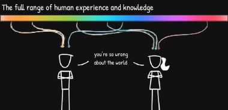

# Home
## About
### Me in 1 second
This is my half-baked bio.
A product nerd exploring the landscape of design and development of products.

### Me in 30 Seconds
Hi there, I am Mohan. You may know me as [algokun](https://www.twitter.com/algokun). I'm a design minded developer and a product nerd — who believes **empathy** can be used to solve most of the user problems in the world.

I like to see how my ideas 💭 could be converted to products 📺

I've been coding since 16 and have experience with various web and mobile technologies such as Node.js, React, Flutter.

### Website
You just landed on my planet in this huge galaxy of internet and in this planet you may encounter species

- centaur — half-baked notes
- unicorns — high-value stuff
- pegasus — personal projects

I created this planet to help me write, share and connect with other planets in this huge galaxy of internet.

Coming to the development side of this planet, I pledge to keep things minimal and simple right from the start and that's reason I decided to ditch everything and chose [Mizi](), a static site generator built with C++.

### Goal
- Further Exploration in design and development
- Getting control over my thoughts and achieve inner peace
- Build products that users really need and help them solve their problems.

## Journal
### Repo
Journal is a wall where i document my most recent developer adventures. You can find my journal [here](https://www.journal.algokun.xyz).

# Raw Thoughts
## Understanding and Unlearning
###  

There's a fact that **no two people (even your past self) can understand the same thing in a same way** and how do you learn something that you already know? 
The illiterate of the 21st century will not be those who cannot read and write, but those who cannot **learn, unlearn and relearn** - [Alvin Toffler](https://en.wikipedia.org/wiki/Alvin_Toffler)
Ever faced with a situation where you understood something in the past and now it doesn't make sense? It's might be of two reasons - you memorise it or you just consumed a part of the spectrum 
If you memorise something, it is because you assumed you understood something and the gaps are left unfilled. To test your understanding, you can either teach someone (it could be you) or write it down or attack it from multiple things
Feynman beautifully puts **You don't fool yourself and you're the easiest one to fool**
The ability to rethink and unlearn matters most. As, you're just biased towards your existing knowledge and you can't foresee what you know. **The greatest enemy of learning is what you think you know**
To understand the whole spectrum, you need to unlearn and gain new lens to see your past knowledge.
Thanks for coming this far by reading everything. I'm trying to write my raw thoughts about a topic and this is the first one.

## How to maintain information diet?
###  
Most of what we consume these days is the mental equivalent of junk food. 

We always been the victims of clickbaits, instead spending our time to delight our minds with content we consume. We've been hooked by our social media feeds and they trapped us in the timeloop. We become the modern hamster, who's running constantly on a wheel.

Here's what I'm doing to fight with modern consumption

- Start any fiction or history book, that you can love reading.
  The goal for someone who's recently getting started to read books is that "read what you love until you love reading"
- Hit dopamine by watching some good-old movies (my all time favs are - fightclub,eternal sunshine of spotless mind...).
- Read personal blogs of people who you found intresting
  This is yet another way of learning, where you get your content from their experiences
- Read the reading list of other people chances are you might not find them that intresting, you can always drop something you don't like
- Create your own feed using RSS. I recently discovered the power of RSS and how can one create their own feed is really fascinating.

# Collections
## Movies
### 90s Cult Classics 
I recently started watching good old hollywood movies and enjoyed each and every film.

I felt delightful and can't put the feeling into words. I'm just awestruck. Here's my list and I hope you'll enjoy too

- The Sixth Sense
- The Shawshank Redemption
- Memento
- Fight club
- Se7en 1995
- The Eternal Sunshine of the Spotless Mind
- Truman Show
- Forrest Gump
- Cast Away
- The Usual Suspects
- American Beauty
- The Silence of the lambs
- Being John Malkovich
- Donnie darko
- The matrix
- Good will hunting

### 2000s Gems
From this era, the production quality is skytouching.

- Shutter island
- Catch me if you can
- The Man from Earth
- Pursuit of happiness
- The Prestige
- Zodiac
- Into the wild
- Knowing (film)
- Apocalypto

